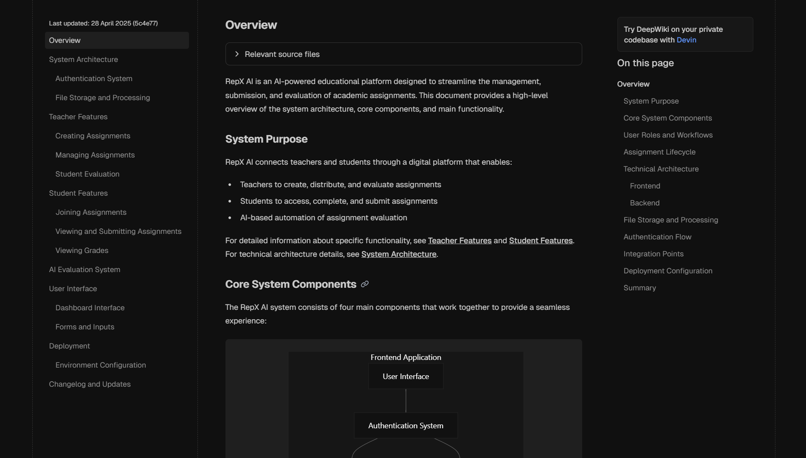

# Repx AI

Repx AI is a platform for evaluating and improving our education system through AI-powered report assessment and feedback.

[](https://deepwiki.com/Rep-X-AI/repx-ai)

## 🚀 About The Project

Repx AI is an innovative platform designed to streamline report evaluation in educational settings. Our AI-powered system helps teachers save time on grading while providing students with detailed, insightful feedback to improve their learning outcomes.

### Key Features

- **Online Exams and Assignments**: Create assignments where multiple students can post their reports
- **AI-Powered Evaluation**: Automated assessment of student reports with detailed feedback
- **Diagram Analyzer**: Analyzes reports using teacher-inputted keywords, diagrams, and equations
- **Sentimental Extra Grading**: Grades reports based on content sentiment and teacher feedback
- **Content Generation**: Assistance with generating educational content
- **Browse History**: Students and teachers can view their attended and authored exam histories

### Want a structured doc ?

[Repx AI Docs](https://deepwiki.com/Rep-X-AI/repx-ai)



## 🛠️ Built With

- [React.js](https://reactjs.org/) - Frontend framework
- [Firebase](https://firebase.google.com/) - Authentication and database
- [Tailwind CSS](https://tailwindcss.com/) - Styling
- [React Router](https://reactrouter.com/) - Navigation
- [AOS](https://michalsnik.github.io/aos/) - Animations

## 🏁 Getting Started

Follow these steps to set up the project locally.

### Prerequisites

- Node.js (v14 or later)
- npm or yarn

### Installation

1. Clone the repository

   ```sh
   git clone https://github.com/Rep-X-AI/repx-ai.git
   ```

2. Navigate to the project directory

   ```sh
   cd repx-ai
   ```

3. Install dependencies

   ```sh
   npm install
   # or
   yarn install
   ```

4. Create a `.env` file in the root directory with your Firebase configuration

   ```env
   REACT_APP_FIREBASE_API_KEY=your_api_key
   REACT_APP_FIREBASE_AUTH_DOMAIN=your_auth_domain
   REACT_APP_FIREBASE_PROJECT_ID=your_project_id
   REACT_APP_FIREBASE_STORAGE_BUCKET=your_storage_bucket
   REACT_APP_FIREBASE_MESSAGING_SENDER_ID=your_messaging_sender_id
   REACT_APP_FIREBASE_APP_ID=your_app_id
   ```

5. Start the development server

   ```sh
   npm start
   # or
   yarn start
   ```

## 📚 Usage

### For Teachers

1. Register as a teacher to access your dedicated dashboard
2. Create assignments with specific requirements and deadlines
3. Share the class code with your students
4. Review submitted reports with AI-assisted grading
5. Provide additional feedback as needed

### For Students

1. Register as a student to access your dedicated dashboard
2. Join classes using the code provided by your teacher
3. View and submit assignments before deadlines
4. Receive detailed feedback and grades on your submissions
5. Track your progress over time

## 🤝 Contributing

Contributions are what make the open-source community such an amazing place to learn, inspire, and create. Any contributions you make are **greatly appreciated**.

Please see our [CONTRIBUTING.md](CONTRIBUTING.md) for details on our code of conduct and the process for submitting pull requests.

## 📄 License

This project is licensed under the MIT License - see the [LICENSE](LICENSE) file for details.

## 📞 Contact

- Email: [repxaicontact@gmail.com](mailto:repxaicontact@gmail.com)
- Phone: +13 22334-55664

## 🔗 Links

- [Wiki](https://deepwiki.com/Rep-X-AI/repx-ai)
- [GitHub Repository](https://github.com/Rep-X-AI/repx-ai)
- [Live link](https://repxai.vercel.app)

## Authors

- [Subhadeep Roy](git.new/Subha)
- [Satyaki Dey](https://github.com/SatyakiDey75)
- [Priyanshu Dutta](https://github.com/priyanshudutta04)
- [Rishi Bhattasali](https://github.com/Rishi2403)
- [Arunava Dutta](https://github.com/ArunavaCoderEm)
- [Pretisha Sahoo](https://github.com/PretishaSahoo)

---
